### Your Beyond Bacteria Sample Deep Shotgun Metagenomics Report

Thank you for your participation in the American Gut Project though the Beyond
Bacteria Perk and we appreciate your patience while we transitioned the sample
processing for this perk from out collaborators to our in-house team at UC San
Diego.

 __DISCLAIMER: The following report is intended FOR RESEARCH USE ONLY and is not a diagnostic test of
any kind. It should *NOT* be used to inform any clinical, medical, or otherwise health- or 
lifestyle-related decision-making, behavior, or activity. As scientists we do our best to
vet our data, ensure data integrity and provide the latest and best tools and analyses
available, but we do not provide any medical or clinical information or advice and no
information on specific organism found in the sample you provided is intended to be used
for this purpose.__

In the Knight Lab, part of the Center for Microbiome Innovation at UC San Diego, 
we extracted DNA from your sample using the Earth Microbiome Project(EMP) standardized
protocol that was recently published in the November 2017 edition of Nature [https://www.nature.com/articles/nature24621],
and is available on the EMP website [http://www.earthmicrobiome.org/protocols-and-standards/dna-extraction-protocol/] for easy reference. The extracted metgenomic DNA was
then prepared for sequencing using our state-of-the art shotgun library preparation
and sequenced on a HiSeq4000.

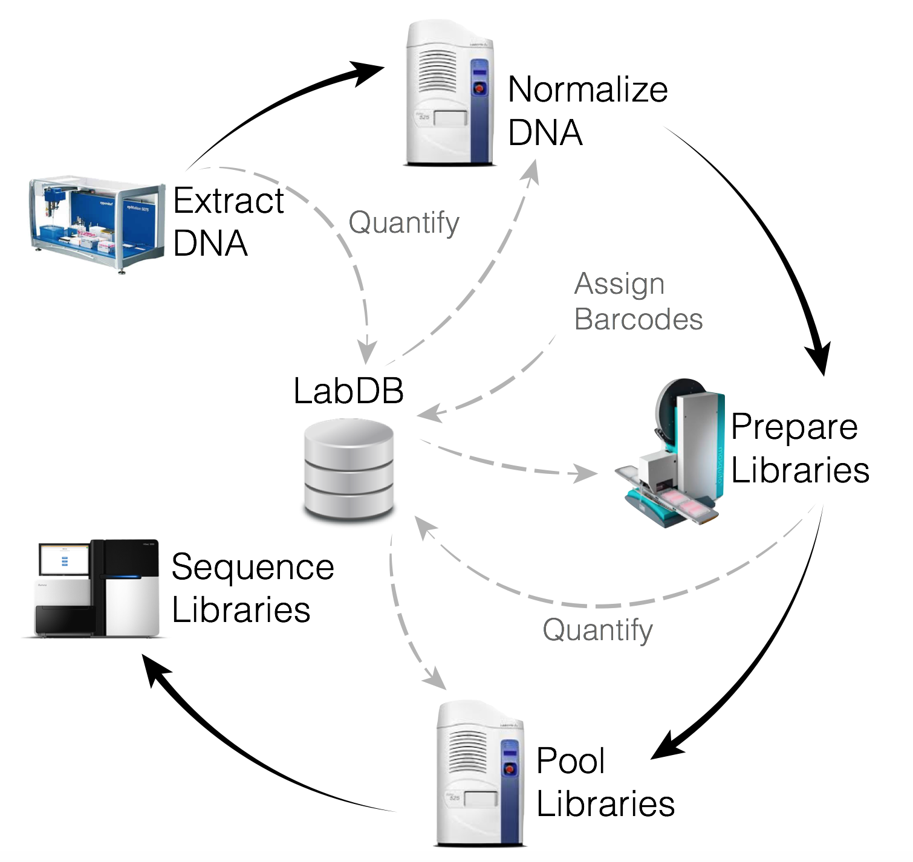

Following sequencing, your samples were processed using the [Oecophylla](https://github.com/biocore/oecophylla) sequencing analysis
pipeline under development in the Knight Lab using our supercomputing cluster
'Barnacle', which is housed in the SDSC data center and managed by Knight Lab systems administrators. The Barnacle cluster includes 1024 Intel Ivy-bridge compute cores as well as 384 AMD compute cores, 12TB of total Ram with a 10GbE compute
network. Storage includes 250TB of primary storage with equal amounts of dedicated backup for the different file systems. Unlike the amplicon sequencing data we use for the standard kit processing for the AGP which only detects bacteria whose 16S rRNA gene matches the patterns we commonly look for, deeper shotgun metagenomic sequencing detects all genomic DNA in the sample regardless of the type of organism prsent. This means that not only can we pick up microbes other than bacteria, but we have a lot more data to sort through and we can go beyond the operational taxonomic units (OTUs) reported for our
standard kit assessment to determine species and sometimes even strain-level identity for the microbes in
your sample.

If you would like to access your raw data, please contact us at info@americangut.org and we can provide you with instructions to access these large sequencing files. This data has been filtered to remove sequences that did not pass our quality control parameters, including the removal of sequences that matched to the human genome or our sequencing controls so these will not be
present in the data.

In the Oecophylla pipeline, the sequencing reads are matched to phyla, genera, and species using the [Kraken
database] (https://ccb.jhu.edu/software/kraken/) and functional pathways are identified using [HUMANN2](http://huttenhower.sph.harvard.edu/humann2).

### Results

The vast majority of the organisms detected in your sample were bacterial, and although many species were identified in your sample, a few types of organisms tended to dominate most of the stool sample you provided.
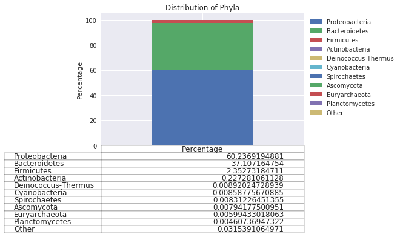
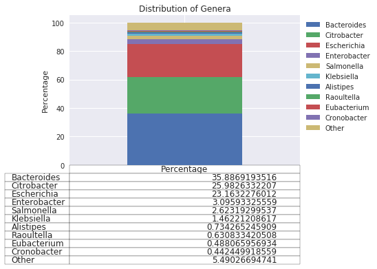
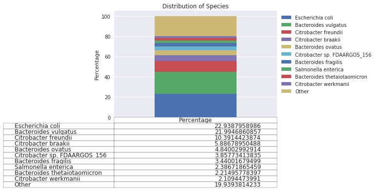

Since the whole metagenomic sequencing pipeline is able to capture organisms beyond bacteria we have highlighted the most commonly detected viruses and fungi as well, though verall these were in much lower abundance. 

Compared to the bacteriome, relatively little is known about the rapidly evolving viruses that dwell on the bounadary between life and abiotic existance. This is relfected in the large number of unassigned, putative viral DNA detected:

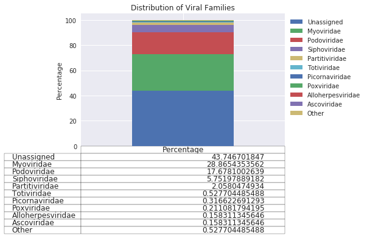
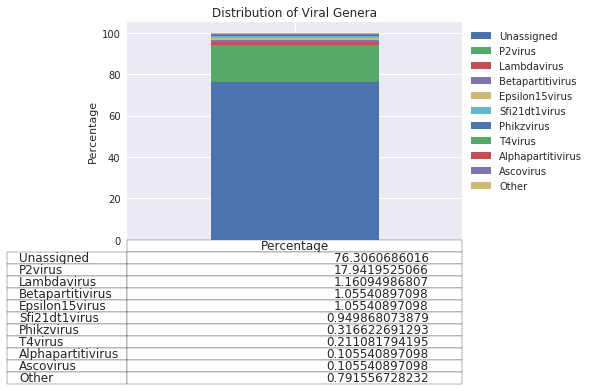
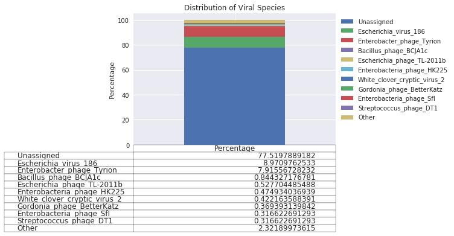

The fungal microbiome has been studied in detail primarily through model organisms and the food we consume such as beer, wine, cheese, which often contains fungi, or in the case of mushrooms and truffles entirely fungal. We fond a small amount of fungi in your stool sample and the top organisms are highlighted here:

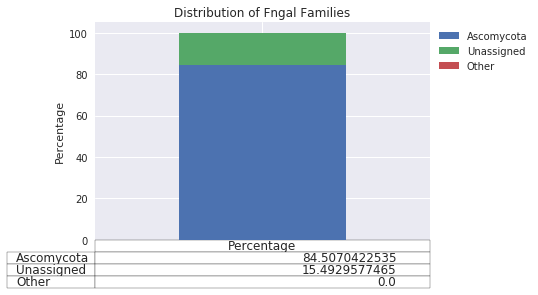
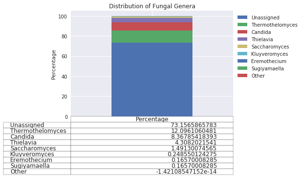
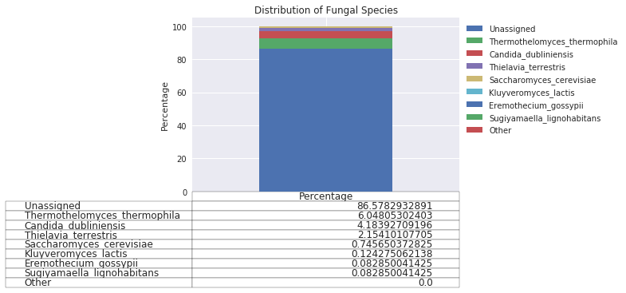

To view a detailed breakdown of the organisms detected in your sample together please use the following links:
[example biom](https://view.qiime2.org/visualization/?type=html&src=https%3A%2F%2Fdl.dropbox.com%2Fs%2Fgs7yjssl5xk0xb5%2Fmerged_kraken_phylum_table.qzv%3Fdl%3D1)

The microbes that live in us rely on a huge variety of functional pathways to keep growing, multiplying, 
helping, and sometimes harming, us. The top 10 pathways detected in the provided stool sample are below:
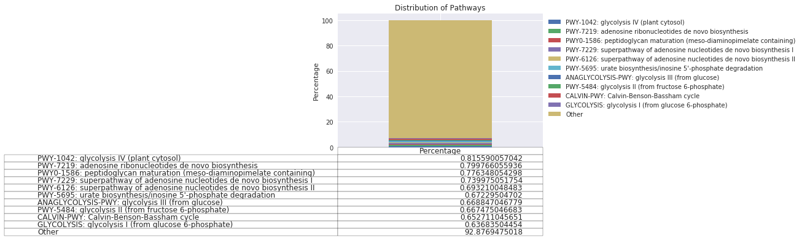

In our latest round of participation for this perk we had 17 total participants
who all provided stool samples. Your sample was combined for analysis with these
participants and ~500 other AGP participants whose samples have been processed
for deeper shotgun metagenomic sequencing through sponsorship from outside partners.

To visualization your sample in the context of these individuals, we have compressed all of the information about the composition of your sample into a single point and measured its similarity to the other individuals. We can compress this data in two primary forms.

The first, called Jaccard distance, only considers the presence or absence of organisms in a sample from an individual while the second measurement, Bray-Curtis distance, takes into count the relative abundance of the organisms. Each of these is displayed in a Principal Coordinates Analysis (PCoA) plot, just like the figures that you have likely seen Rob Knight present in his [TED talk].

The PCoA for each type of measurement can be visualized in an [Emperor](https://biocore.github.io/emperor/) plot at these links:
[Jaccard]()
[Bray-Curtis]()

The Emperor plot is a powerful way to explore the context for your sample. To view your sample in the context of the others, we recommend the following steps:
Option 1- Automatic configuration:
a) Download this [Emperor Settings File](img/emperor-settings.json)
b) Open the link to the PCoA above
c) Right click in the middle of the graph and select "Load Settings"
d) Select the Emperor Settings File you downloaded
Option 2- Manual configuration:
a) Open the link to the PCoA above
b) Select the 'Scale' tab from the menu on the right side of the plot
c) Click on the box labeled "Select a Scale category"
d) Type 'your_sample' and press the Enter[Return on Mac] key on your keyboard
e) Click the '1' next to the word 'you' and then drag the slider to the right to increase the size of your sample.
f) Click on the 'Shape' tab from the menu on the right side of the plot
g) Click on the box labeled "Select a Shape category"
h) Type 'your_sample' and press the Enter[Return on Mac] key on your keyboard
i) Click on the dropdown menu on the left side of the box labeled 'you' and select an option to set the shape of your sample.

Additional information for navigating the Emperor display can be found on the [Emperor website](https://biocore.github.io/emperor/).

Beyond visualizing your sample in the context of others, we can also examine the diversity of the community within your sample, known as alpha diversity, to see how you compare to the other individuals sequenced. The most straightforward way to do this is to look at the number of organisms found in your sample. A plot of this information is [here](). As with the manual method before you'll want to select 'your_sample' from the menu to see how you compare with the rest of the AG participants.

Another popular method for examining diversity was developed by Claude Shannon to quantify the entropy (uncertainty or information content) in the 1940s, but was quickly adopted by the ecological and later microbial ecology communities as this metric is a good way to capture the complexity of a community of organisms. A plot of Shannon diversity can be found [here]()
